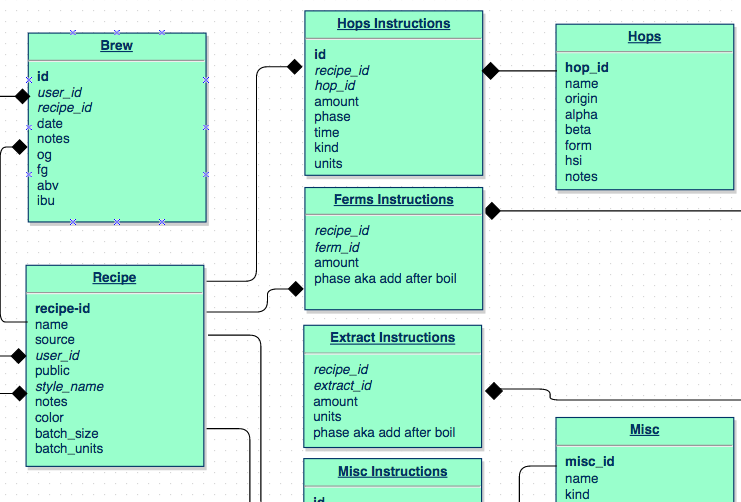
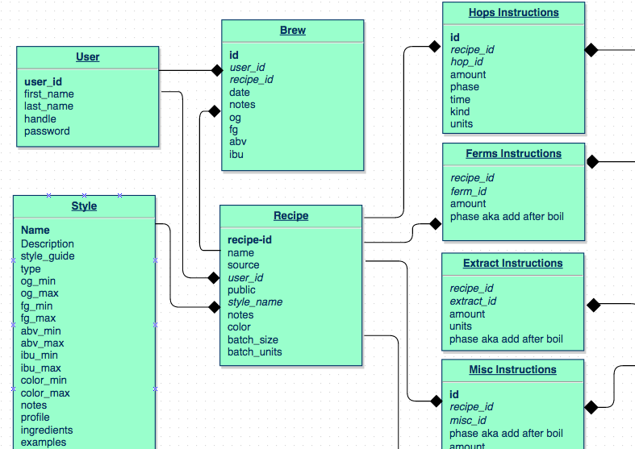
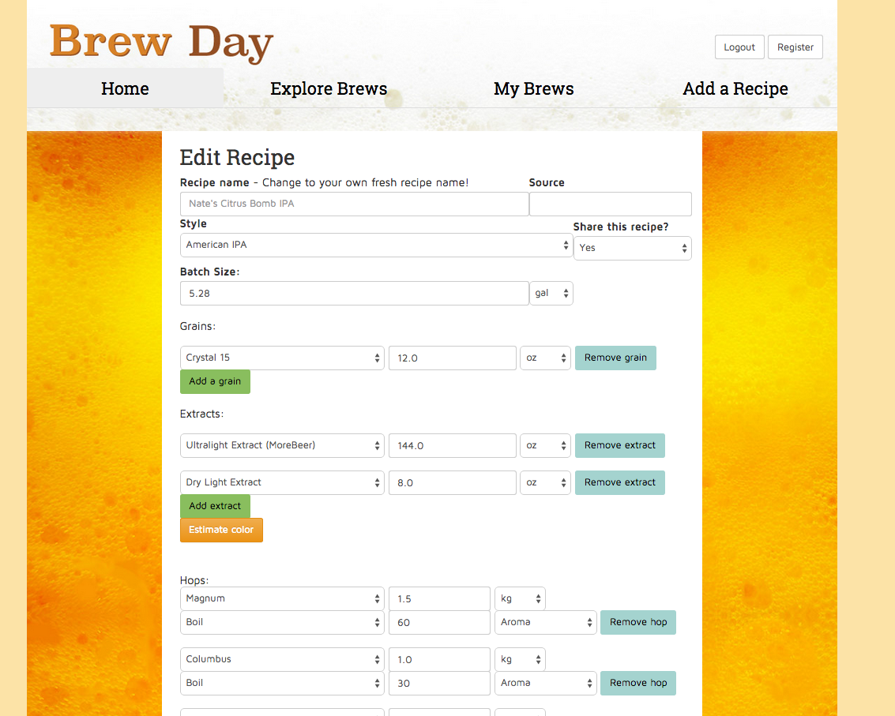
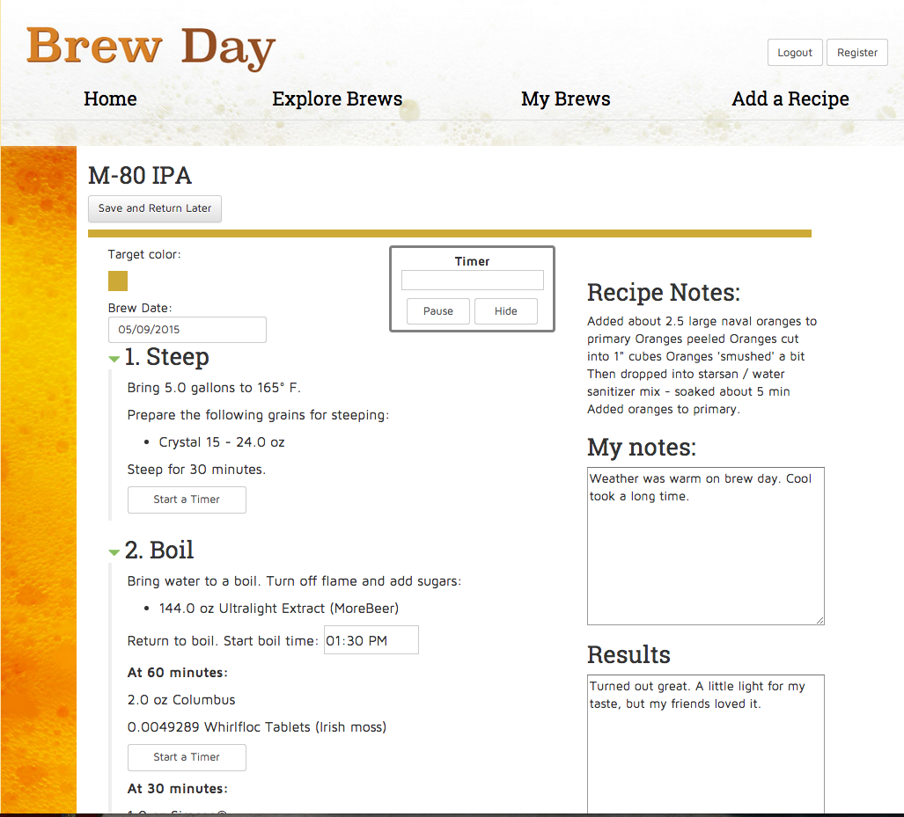

# Brew Day

Brew Day is both a repository for beer recipes and a brew day guide. Users can access recipes shared from other users and add their own to share or for their own use. New recipes can be added manually, uploaded in beer xml format, or be created based on existing recipes by editing an exisitng recipe and making a new version. All forms give users a comprehensive selection of recipe ingredients to build their recipe and a complete list of styles to identify the right style. The brew day page is a guide that organizes the brew by time,  and provides timers for each stage in the brewing process. The brew day guide also allows users to set calendar reminders in five different calendar apps (Google, Outlook, iCal, Outlook Online, and Yahoo Calendar). Users can record notes on the brewing process and make comments and rate the beer. The My Brews page lets users see a table of their brews, which can be filtered by completed brews or brews in progress. 

This app was an independent student project, built as part of the Hackbright Academy Fellowship to showcase some of what I learned in the program. 

### Stack
   - XML
   - SqlAlchemy
   - Sqlite 
   - Element Tree
   - Flask
   - Jinja
   - Javascript
   - JQuery
   - Ajax
   - JQuery UI
   - HTML
   - CSS
   - Add-a-Calendar
   - Tock
   - Bootstrap

### Data Handling

Brew Day utilizes databases of ingredients and styles from XML and stores them in SQL through a seed file. The data model connects recipes and ingredient details through ingredient instructions tables. Recipes connect to style descriptions, users and brews, which are instances of making a recipe.



Recipes are associated with users and brews stores details about a user's brew of a recipe:



User recipe entries are checked through an Ajax call to prevent duplicates and upload recipes are checked in python. 

Fields for data input are dynamic, meaning that users can enter any number of data groups for a given ingredient type (e.g. a recipe could have one hop or six). The information is serialized in the jQuery and parsed in Python. 

Color calculations are done for each recipe after all ingredient instructions are uploaded and users can check the expected outcome of a recipe through an Ajax call to the server to calculate the color and convert it to a hexidecimal display. 

### User Interaction

Functions in the builder file pull data from SQL and organize into recipes, dropdown lists and brews.

The explore brews page provides options to search by style, recipe name or list all a user's own recipes. When a recipe is selected the recipe displays and users can choose to brew it, make a version or delete the recipe. 


The information for the brew day page is organized by stage and time of the brewing process. A timer responds to buttons in various steps in the recipe with a javascript powered timer with a time showing the delta to the next action. The user enters the time at the start of the boil which is immediately sent via Ajax to the backend to safeguard the starting time should the browser be closed. 


Long term steps may be recorded into the user's calendar through the Add to Calendar utility integrated into the site. The user can record the original gravity and final gravity and get a calculation of the alcohol by volume of his/her beer. 

The user's my brews page shows summary tables of the user's brews, completed and in progress, including notes on brew, results, a rating of the results and basic data about the beer. 

### Usage

Set up environment 
``` sh
pip install -r requirements.txt
```
Create a directory "uploads" in tmp  
``` sh
mkdir /tmp/uploads 
```
Run seed file
``` sh
python seed.py
```
Run server file
``` sh
python server.py
```


